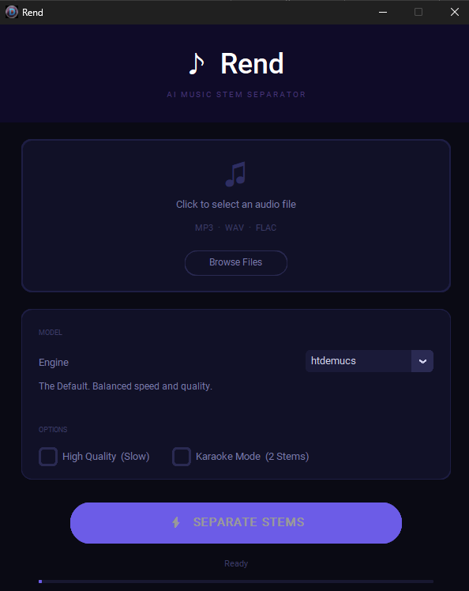

# Rend

A minimal, dark-mode Windows GUI for AI music stem separation using [Demucs](https://github.com/adefossez/demucs), built with CustomTkinter and packaged as a single-file EXE.

<p align="center">
  
</p>

## Features

- **Animated Splash Screen**: Rose Orbit math-curve loader animates during startup while heavy libraries load in the background
- **6 Model Options**: htdemucs, htdemucs_ft, htdemucs_6s, mdx, mdx_extra, mdx_q — choose your speed/quality tradeoff
- **Karaoke Mode**: Automatic 2-stem output (vocals + accompaniment) for backing tracks
- **High Quality Mode**: Enable `shifts=2` for slower but higher-precision separation
- **Cancel During Processing**: Stop an active separation at any segment boundary
- **Open Output Folder**: Completion dialog offers one-click folder access
- **GPU Acceleration**: Auto-detects an NVIDIA (CUDA) GPU and uses it when present, falling back to CPU otherwise — shown by the ● GPU / ● CPU status light. (The prebuilt installer ships CPU-only PyTorch; GPU requires a source install with a CUDA build of PyTorch.)
- **Offline Execution**: Full separation without internet (after initial model download), on CPU or GPU
- **WAV or FLAC Export**: Direct output via soundfile — 32-bit float WAV (lossless headroom) or 24-bit FLAC (~half the size)
- **Dark Mode UI**: Clean, modern palette with real-time status lights (FFmpeg, Online)
- **Responsive Threading**: UI stays responsive during heavy processing
- **About Pane**: Version, dependency credits, environment health, and a one-click bug-report link

## Downloads

**Windows users: Get the latest installer (`Rend-Setup-<version>.exe`, no Python required) from [Releases](https://github.com/DQ-Labs/Rend/releases).**

The installer adds a Start-menu entry, installs to `Program Files\Rend`, and registers an uninstaller in Windows **Apps & Features**.

## Model Selection

| Model | Speed | Quality | Best For |
|---|---|---|---|
| `htdemucs` | ⚡⚡ | ⭐⭐⭐ | **Default.** Balanced, good starting point. |
| `htdemucs_ft` | ⚡ | ⭐⭐⭐⭐ | Fine-tuned. Better vocals, ~4× slower than default. |
| `htdemucs_6s` | ⚡⚡ | ⭐⭐⭐ | 6-stem split (Drums, Bass, Vocals, Guitar, Piano, Other). |
| `mdx` | ⚡⚡ | ⭐⭐⭐ | Classic. Trained on MusDB HQ. Solid baseline. |
| `mdx_extra` | ⚡ | ⭐⭐⭐⭐ | High precision. Extra training data for complex mixes. |
| `mdx_q` | ⚡⚡⚡ | ⭐⭐ | Quantized. Smallest download, lower quality. |
| **RoFormer Vocals** | 🐢 | ⭐⭐⭐⭐⭐ | Cleanest vocal/instrumental split — the best option for karaoke and backing tracks. 913 MB download, ~5× song length on CPU, and **needs a machine with more than 8 GB RAM** (see below). |
| **RoFormer Guitar** | 🐢 | ⭐⭐⭐⭐ | Guitar isolation, markedly cleaner than Demucs on distorted guitar. 45 MB download, ~3× song length on CPU. |

The two RoFormer models are downloaded on first use from their author's own
HuggingFace repository, not bundled: they are published without a license grant,
so Rend shows the licence state and asks before fetching anything.

## Installation

### Prerequisites

- **Python 3.10+**
- **FFmpeg**: `ffmpeg.exe` and `ffprobe.exe` in the root directory (only for source installs)

### From Source

1. Clone the repository:
   ```bash
   git clone https://github.com/DQ-Labs/Rend.git
   cd Rend
   ```

2. Create and activate a virtual environment:
   ```bash
   python -m venv venv
   .\venv\Scripts\activate
   ```

3. Install dependencies:
   ```bash
   pip install -r requirements.txt
   ```

4. Install Demucs from pinned source with Windows patches:
   ```powershell
   .\setup_dev.ps1
   ```

5. Run the app:
   ```bash
   python app.py
   ```

## Usage

1. **Select Audio**: Click the file zone and choose an MP3, WAV, or FLAC file
2. **Pick a Model**: Choose from the 6 available options (see Models above)
3. **Set Options**: Toggle High Quality mode or Karaoke Mode as desired
4. **Separate**: Click **SEPARATE STEMS** and watch the progress
5. **Cancel**: Click **Cancel** anytime to stop mid-processing
6. **Open**: When done, click "Open output folder?" to browse the results

Output stems are saved as WAV files in a folder next to your input file (e.g., `mysong.mp3` → `mysong_stems/`).

## Building from Source

To create a standalone `Rend.exe`:

1. Ensure prerequisites are met and virtual environment is activated
2. Run PyInstaller:
   ```bash
   pyinstaller Rend.spec --clean --noconfirm
   ```

The EXE will be in `dist/Rend.exe`. The spec file bundles FFmpeg, Demucs source, and all hidden imports automatically.

### Building the Installer

To wrap `dist/Rend.exe` in the Windows installer that releases ship:

1. Install [Inno Setup](https://jrsoftware.org/isinfo.php) 6.3+ (`choco install innosetup`)
2. Run the build script:
   ```bash
   python installer/build_installer.py
   ```

The installer will be in `dist/installer/Rend-Setup-<version>.exe`. The script reads the app name, version, publisher, and URLs from `config.py` and passes them to Inno Setup as `/D` defines, so `installer/Rend.iss` never duplicates them.

## Known Behavior

- **First Launch**: The EXE may take ~30 seconds to start (PyInstaller one-file unpacking). Subsequent launches are faster.
- **First Separation**: On the very first run, the app downloads the selected model (~200 MB–1 GB depending on model). This requires internet and takes a few minutes. All subsequent runs are fully offline.
- **Windows SmartScreen**: The unsigned installer may trigger a warning when run. Click "More info" → "Run anyway" to proceed.
- **Memory**: the Demucs models are happy in ~2 GB and run fine on an 8 GB machine. The **RoFormer models are far hungrier** — measured at 7.4 GB of 7.8 GB on an 8 GB laptop, which leaves Windows paging and a separation that effectively never finishes. On 8 GB, stick to the Demucs models; RoFormer wants 16 GB.

## Releasing (maintainers)

Releases are built by CI, never by hand:

1. Bump `APP_VERSION` in `config.py` (the single source of truth for the app's name, version, and URLs).
2. Tag the commit to match and push: `git tag v1.1.0 && git push origin v1.1.0`.
3. CI verifies the tag matches `config.py`, builds the EXE, wraps it in the Inno Setup installer, and creates a **draft** GitHub release with the installer attached.
4. Install-test the installer on a machine without the dev environment, then publish the draft.

## Architecture

- **Single-Source Identity**: `config.py` defines the app name, version, URLs, and credits; the splash, window title, About pane, installer, and CI all read from it
- **Core / GUI split**: `rend_core.py` holds all separation logic — the worker thread, karaoke mixdown, stem saving, progress mapping, output-folder naming, error logging, and the FFmpeg/online diagnostics — and imports no GUI libraries. `app.py` is a thin CustomTkinter shell on top of it.
- **Headless tests**: `tests/test_rend_core.py` exercises the core module without a display, demucs, or model downloads; CI runs it on every push and PR before any build starts.
- **Local Demucs**: The project vendors demucs source at a pinned commit with Windows compatibility patches applied (`rend_core` imports it lazily, only when a separation actually runs)
- **CustomTkinter UI**: Dark-mode, palette-driven design with responsive threading
- **PyInstaller Bundling**: Handles FFmpeg, demucs source, and transitive dependencies via explicit `hiddenimports`
- **Inno Setup Installer**: `installer/build_installer.py` compiles `installer/Rend.iss` with identity values from `config.py`, producing the versioned installer that releases ship

### Running the tests

```bash
pip install pytest
pytest tests/ -v
```

The tests need only the packages in `requirements.txt` — no FFmpeg, demucs install, or model downloads.

## Troubleshooting

### Red FFmpeg indicator

If the **● FFmpeg** status dot is red, the app cannot find FFmpeg on your PATH or in the project root.

**This only affects source installs.** The standalone EXE bundles FFmpeg automatically.

For source installs: Download FFmpeg from [gyan.dev/ffmpeg/builds](https://www.gyan.dev/ffmpeg/builds/), extract `ffmpeg.exe` and `ffprobe.exe`, and place them in the Rend project root alongside `app.py`.

### Model download stuck

If the first separation seems to hang during model download, check your internet connection. Large models (mdx_extra ~1 GB) may take several minutes.

### Separation errors

If a separation fails, the full error details are written to `%LOCALAPPDATA%\Rend\error.log` — please attach it when reporting an issue. The **About** pane (bottom-right of the app) has a "Report a Bug" button that opens a pre-filled issue template.

## License

MIT License. Copyright (c) 2026 DQ-Labs.

This software uses [Demucs](https://github.com/adefossez/demucs), which is also licensed under the MIT License (Copyright © Facebook, Inc. and its affiliates).
